<div align="center">

# CallOS

**Enterprise AI Voice Agent Platform with a Self-Improving Fine-Tuning Loop**

[](https://python.org)
[](https://google.github.io/adk-docs/)
[](https://fastapi.tiangolo.com)
[](https://twilio.com)
[](https://deepgram.com)
[](https://elevenlabs.io)
[](https://streamlit.io)
[](https://cloud.google.com)

*Live calls → post-call scoring → DPO alignment → weekly fine-tune → better calls. The loop runs itself.*

*8 agents × 6 MCP servers × 28 tools → a voice AI that gets measurably smarter every 7 days.*

</div>

---

## What It Does

A company plugs in their product knowledge base and CRM. CallOS handles inbound support calls end-to-end — transcribing audio in **~150ms**, routing through a multi-agent compliance and sentiment system, retrieving from a company knowledge base via RAG, and synthesizing a voice response in **~75ms** — for a total pipeline latency under **700ms**.

After each call, a post-call intelligence pipeline scores the conversation, classifies the lead, predicts churn risk, and extracts product signal. Every week, an **APScheduler cron** automatically runs a **QLoRA SFT + DPO alignment** fine-tuning cycle on the highest-scoring calls — with a **DeepEval CI gate** that blocks bad adapters from ever reaching production. The agent measurably improves every 7 days with zero human labeling.

**Core problem it solves:** Most voice agent deployments are static. They're configured once and decay as products change, objections evolve, and customer language shifts. CallOS is the first open-source platform where the agent learns continuously from its own production traffic through a fully automated, quality-gated fine-tuning loop.

---

## Architecture

```mermaid
flowchart TD
    classDef telephony fill:#dbeafe,stroke:#2563eb,stroke-width:2px,color:#1e3a8a
    classDef voice fill:#d1fae5,stroke:#059669,stroke-width:2px,color:#064e3b
    classDef agent fill:#fce7f3,stroke:#db2777,stroke-width:2px,color:#831843
    classDef mcp fill:#fef3c7,stroke:#d97706,stroke-width:2px,color:#78350f
    classDef pipeline fill:#ede9fe,stroke:#7c3aed,stroke-width:2px,color:#4c1d95
    classDef finetune fill:#fee2e2,stroke:#dc2626,stroke-width:2px,color:#7f1d1d
    classDef data fill:#e0f2fe,stroke:#0284c7,stroke-width:2px,color:#0c4a6e
    classDef obs fill:#f1f5f9,stroke:#64748b,stroke-width:2px,color:#1e293b

    Twilio["Twilio ConversationRelay<br/>WebSocket audio stream"]:::telephony

    subgraph VOICE ["Real-Time Voice Pipeline · &lt;700ms end-to-end"]
        direction LR
        Deepgram["Deepgram Nova-3<br/>STT · ~150ms"]:::voice
        LiveAgent["Live Voice Agent<br/>Root Orchestrator · A2A"]:::agent
        ElevenLabs["ElevenLabs Flash v2.5<br/>TTS · ~75ms"]:::voice
    end

    subgraph AGENTS ["Google ADK Multi-Agent System"]
        direction LR
        Compliance["Compliance Guard<br/>real-time phrase monitor"]:::agent
        Sentiment["Sentiment Detector<br/>escalation trigger"]:::agent
        KB["Knowledge Retrieval<br/>two-stage RAG"]:::agent
        HITL["HITL Coordinator<br/>asyncio.Future pause/resume"]:::agent
    end

    subgraph MCP ["6 MCP Servers · 28 Tools (stdio)"]
        direction LR
        CRM["crm_server · 6 tools"]:::mcp
        KBS["kb_server · 4 tools"]:::mcp
        CALLS["call_server · 5 tools"]:::mcp
        CAL["calendar_server · 3 tools"]:::mcp
        SCR["scorer_server · 4 tools"]:::mcp
        ANL["analytics_server · 6 tools"]:::mcp
    end

    subgraph POSTCALL ["Post-Call Intelligence Pipeline"]
        direction LR
        LeadScorer["Lead Scorer<br/>HOT / WARM / COLD"]:::pipeline
        Churn["Churn Predictor<br/>at-risk account flag"]:::pipeline
        Topics["Topic Extractor<br/>complaint clustering"]:::pipeline
    end

    subgraph FINETUNE ["Self-Improvement Fine-Tuning Loop (Weekly · APScheduler)"]
        direction LR
        Filter["Quality Filter<br/>score ≥ 80"]:::finetune
        Dataset["Dataset Builder<br/>SFT + DPO pairs"]:::finetune
        QLoRA["QLoRA SFT<br/>LLaMA-Factory · RTX 3050"]:::finetune
        DPO["DPO Alignment<br/>TRL · KL-penalised"]:::finetune
        EvalGate["DeepEval Gate<br/>blocks bad adapters"]:::finetune
        ABDeploy["A/B Deploy<br/>5% traffic split"]:::finetune
    end

    subgraph DATA ["Data & Observability"]
        direction LR
        DB[("PostgreSQL + pgvector<br/>SQLite locally")]:::data
        Cache[("Redis<br/>in-process dict locally")]:::data
        Langfuse["Langfuse<br/>traces · cost · evals"]:::obs
    end

    Twilio --> Deepgram --> LiveAgent --> ElevenLabs --> Twilio
    LiveAgent --> Compliance & Sentiment & KB & HITL
    LiveAgent --> CRM & KBS & CALLS & CAL & SCR & ANL
    LiveAgent --> LeadScorer & Churn & Topics
    LeadScorer & Churn & Topics --> Filter
    Filter --> Dataset --> QLoRA --> DPO --> EvalGate --> ABDeploy --> LiveAgent
    LiveAgent & POSTCALL -.-> DB & Cache
    LiveAgent -.-> Langfuse
```



---

<div align="center">

## Agents

| Agent | Type | Key Capability | Output |
|:---:|:---:|:---:|:---:|
| **Live Voice Agent** | `LlmAgent` (root) | Real-time STT→LLM→TTS loop, A2A coordination, MCP tool use | Voice response + call record |
| **Compliance Guard** | `LlmAgent` (sub) | Banned phrase detection — GDPR/TCPA violations in real-time | `{compliant, violations[]}` |
| **Sentiment Detector** | `LlmAgent` (sub) | Anger-word spike threshold (≥2 hits) → escalation flag | `{sentiment, anger_hits, escalate}` |
| **Knowledge Retrieval** | `LlmAgent` (sub) | Two-stage RAG: bi-encoder cosine → CrossEncoder reranking | Grounded KB answer |
| **Lead Scorer** | `LlmAgent` (post-call) | Pydantic v2 JSON schema output, instructor auto-retry | `LeadScore{status, score, reason}` |
| **Churn Predictor** | `LlmAgent` (post-call) | Sentiment arc + unresolved issue patterns → at-risk flag | Churn risk score |
| **Topic Extractor** | `LlmAgent` (post-call) | Clusters complaints by product/feature across call history | Structured topic list |
| **Fine-Tune Coordinator** | Scheduler | Quality filter → dataset builder → trainer → gate → deploy | Updated LoRA adapter |

</div>

---

<div align="center">

## MCP Servers

| Server | Tools | Capabilities |
|:---:|:---:|:---:|
| `crm_server` | 6 | `get_lead`, `create_lead`, `update_lead`, `log_call`, `get_deal`, `push_to_crm` |
| `kb_server` | 4 | `search_kb` (2-stage RAG), `get_faq`, `get_product_info`, `get_pricing` |
| `call_server` | 5 | Call history, transcript storage, outcome logging, call metadata |
| `calendar_server` | 3 | Appointment booking, callback scheduling, availability check |
| `scorer_server` | 4 | Call quality scoring (0–100), metric aggregation, score history |
| `analytics_server` | 6 | Lead funnel %, 7-day conversion trend, quality leaderboard, churn queries |

**28 tools across 6 MCP servers — all speak stdio, all independently testable**

</div>

---

## The Self-Improvement Loop (Core Innovation)

```
Week 0  ─── Base Qwen2.5-7B (cold start)
               │
               ▼
         Live calls accumulate
         Twilio → Deepgram → ADK → ElevenLabs
               │
               ▼
         Post-call scorer runs (LLM-as-judge, 0–100 per call)
               │
               ▼
         Quality filter: score ≥ 80 → passes to dataset builder
               │
               ▼
         Dataset builder:
           transcript → SFT instruction-response pairs
                      + DPO chosen/rejected preference pairs
               │
               ▼
         APScheduler fires Sunday 02:00
           1. QLoRA SFT on high-quality pairs (LLaMA-Factory, ~3hrs on RTX 3050)
           2. DPO alignment on preference pairs (TRL, ~1hr)
           3. DeepEval CI gate — hallucination rate, tool-use accuracy
           4. A/B deploy: 5% of live traffic routed to new adapter
           5. 48hr monitoring window → auto-promote or rollback
               │
               ▼
Week +1 ─── Agent has measurably better conversion + compliance
```

The **quality filter** is the critical piece — fine-tuning on raw calls amplifies bad behaviour. The **DPO alignment step** is what separates this from basic SFT: chosen/rejected pairs from scored calls create a preference signal that pushes the model toward successful call patterns and away from failed ones.

```
[DPO] Quality before: 0.6200
[DPO] Quality after:  0.7800  (Δ +0.1600)
```

---

<div align="center">

## Under the Hood

| Category | Implementation | Why It Matters |
|:---:|:---:|:---|
| **Telephony** | Twilio ConversationRelay WebSocket | Battle-tested enterprise audio streaming; no polling |
| **STT** | Deepgram Nova-3 (~150ms) | 54.2% lower WER vs competitors; streaming transcription |
| **TTS** | ElevenLabs Flash v2.5 (~75ms) | Sub-100ms synthesis; voice cloning; 70+ languages |
| **Agent Orchestration** | Google ADK 2.2 `LlmAgent` + `Runner` | Native MCP support, built-in `InMemorySessionService`, Vertex AI deploy |
| **Inter-agent Comms** | A2A (Agent-to-Agent) protocol | Standardized task delegation between agents — escalation, handoff |
| **Tool Access** | MCP (stdio, 6 servers) | All external data behind a protocol boundary — swap servers without touching agents |
| **RAG** | sentence-transformers bi-encoder → CrossEncoder reranking | Two-stage retrieval cuts hallucinations on company KB |
| **Structured Output** | Pydantic v2 + instructor | Auto-retry on schema validation failure; typed tool I/O throughout |
| **HITL** | `asyncio.Future` + `contextvars` | Real pause/resume on escalation — call stays live while supervisor types |
| **LLM Routing** | LiteLLM: `GOOGLE → GROQ → OPENAI` | Single swap point; free Groq fallback when Gemini quota exhausted |
| **Fine-Tuning** | QLoRA SFT (LLaMA-Factory) + DPO (TRL) | QLoRA fits RTX 3050 6GB; DPO aligns on preference pairs from real calls |
| **Evaluation** | DeepEval (CI gate) + RAGAS (RAG) + Promptfoo (red-team) | Three-layer eval: no bad adapter ships, no bad retrieval ships, adversarial safety covered |
| **Observability** | Langfuse | Per-turn agent traces, cost per call, LLM-as-judge scores in production |
| **Scheduling** | APScheduler `AsyncIOScheduler` | Weekly fine-tune cron with zero infra overhead — runs inside the FastAPI process |
| **Demo UI** | Streamlit (6-stage live simulator) | Visual pipeline walkthrough: STT → LLM → Compliance → Sentiment → Lead Scorer → TTS |

</div>

---

<div align="center">

## Tech Stack

| Layer | Technologies |
|:---:|:---|
| **Orchestration** | Google ADK 2.2 (`LlmAgent`, `Runner`, `InMemorySessionService`) + Vertex AI Agent Engine |
| **Agent Protocol** | A2A (Agent-to-Agent) — inter-agent task delegation and escalation |
| **Tool Protocol** | MCP stdio servers — 6 servers, 28 tools, all independently testable |
| **Telephony** | Twilio ConversationRelay — WebSocket audio streaming |
| **STT** | Deepgram Nova-3 — streaming transcription, ~150ms latency |
| **TTS** | ElevenLabs Flash v2.5 — sub-100ms synthesis, voice cloning |
| **LLM (live)** | Gemini 2.5 Flash via LiteLLM / Groq `llama-3.3-70b-versatile` (fallback) |
| **LLM (fine-tuned)** | Qwen2.5-7B + QLoRA — fits RTX 3050 6GB, zero API cost |
| **Inference Router** | LiteLLM — multi-provider routing with priority fallback chain |
| **Fine-Tuning** | LLaMA-Factory (QLoRA SFT) + TRL (DPO + GRPO alignment) |
| **RAG** | sentence-transformers bi-encoder + CrossEncoder reranking (two-stage retrieval) |
| **Structured Output** | Pydantic v2 + instructor — auto-retry on validation failure |
| **Evaluation** | DeepEval (CI gate) · RAGAS (retrieval quality) · Promptfoo (red-teaming) |
| **Observability** | Langfuse — traces, cost tracking, LLM-as-judge in production |
| **Scheduling** | APScheduler `AsyncIOScheduler` — weekly fine-tune trigger |
| **Database** | PostgreSQL 16 + pgvector (production) / SQLite + aiosqlite (local) |
| **Cache** | Redis (production) / in-process dict pub/sub (local) |
| **Notifications** | Composio — Gmail + WhatsApp post-call summaries, no OAuth boilerplate |
| **Backend** | FastAPI — async WebSocket server for Twilio stream |
| **Demo** | Streamlit — 6-stage live call simulator with real agent runs |
| **Deployment** | GCP Cloud Run + Vertex AI Agent Engine + Artifact Registry |
| **IaC** | Terraform — reproducible GCP infra (Cloud Run, Cloud SQL, Memorystore, Secret Manager) |
| **CI/CD** | Cloud Build 6-step pipeline: test → eval-gate → build → push → deploy |

</div>

---

## Quick Start

```bash
# 1. Clone and create venv
git clone https://github.com/AmanDataGuy/CallOS
cd CallOS
python -m venv venv
venv\Scripts\activate          # Windows
source venv/bin/activate       # macOS / Linux

# 2. Install dependencies
pip install -r requirements.txt

# 3. Configure environment (one LLM key minimum)
cp .env.example .env
# Edit .env: GOOGLE_API_KEY (free @ aistudio.google.com) or GROQ_API_KEY (free @ console.groq.com)

# 4. Initialise database and seed the knowledge base
python scripts/init_db.py      # → creates calls, leads, kb_chunks, analytics tables
python scripts/index_kb.py     # → embeds 3 seed docs into kb_chunks via sentence-transformers

# 5. Start the API server
uvicorn api.main:app --reload --port 8000
# → Swagger at http://localhost:8000/docs

# 6. Simulate a call (no Twilio required)
curl -X POST http://localhost:8000/test-call \
  -H "Content-Type: application/json" \
  -d '{"transcript": "Hi, I want to know about your enterprise pricing"}'

# 7. Run the Streamlit demo (full 6-stage pipeline walkthrough)
streamlit run demo/app.py

# 8. Run the ADK developer playground
adk web ./agents/

# 9. Run tests
pytest tests/ -v
# → 5 deterministic tests pass; 20 DeepEval golden tests skip without judge key

# 10. Run the DeepEval quality gate
deepeval test run tests/test_agent_quality.py
```

---

## Key Endpoints

| Method | Path | Description |
|:---|:---|:---|
| GET | `/` | Health check |
| POST | `/test-call` | Simulate an inbound call — no Twilio required |
| POST | `/incoming-call` | Twilio webhook — returns TwiML for ConversationRelay |
| WS | `/ws` | Twilio ConversationRelay WebSocket (live audio stream) |
| GET | `/escalation/pending` | List calls paused waiting for human supervisor |
| POST | `/escalation/{call_id}/respond` | Unblock a paused HITL escalation |
| GET | `/.well-known/agent.json` | A2A Agent Card — machine-readable agent discovery |
| POST | `/a2a/tasks` | Submit a task (A2A protocol) — returns immediately, runs async |
| GET | `/a2a/tasks/{task_id}` | Poll task status and result |
| POST | `/a2a/tasks/{task_id}/cancel` | Cancel a running task |

---

## HITL (Human-in-the-Loop) Demo

```bash
# Terminal 1 — start the server
uvicorn api.main:app --port 8000

# Terminal 2 — send a call that triggers escalation
curl -X POST http://localhost:8000/test-call \
  -H "Content-Type: application/json" \
  -d '{"transcript": "This is ridiculous and useless, I want to cancel and sue you"}'
# → call is PAUSED, asyncio.Future is blocking — agent is live but waiting

# Terminal 3 — list pending escalations
curl http://localhost:8000/escalation/pending

# Terminal 3 — respond as human supervisor
curl -X POST http://localhost:8000/escalation/<call_id>/respond \
  -H "Content-Type: application/json" \
  -d '{"response": "Offer a 30-day extension and a 20% discount"}'
# → Terminal 2 unblocks; agent resumes and relays the supervisor response
```

The pause/resume is implemented with `asyncio.Future` + Python `contextvars` — the WebSocket stays open and the call does not drop.

---

## A2A Protocol Demo

```bash
# Discover the agent (machine-readable)
curl http://localhost:8000/.well-known/agent.json

# Submit a task
curl -X POST http://localhost:8000/a2a/tasks \
  -H "Content-Type: application/json" \
  -d '{
    "message": {
      "role": "user",
      "parts": [{"type": "text", "text": "What is included in the Enterprise plan?"}]
    },
    "metadata": {"phone_number": "+15551234567"}
  }'
# → {"id": "...", "status": {"state": "submitted"}, "artifacts": []}

# Poll for result
curl http://localhost:8000/a2a/tasks/<task_id>
# → {"status": {"state": "completed"}, "artifacts": [{"name": "call-result", ...}]}
```

---

## Evaluation Framework

Three-layer eval stack covering the full lifecycle:

```
Development  → RAGAS       KB retrieval quality: faithfulness, context precision
CI/CD gate   → DeepEval    hallucination rate, tool-use accuracy — blocks bad adapters from deploying
Red-team     → Promptfoo   adversarial calls: rude callers, jailbreak attempts, edge cases
Production   → Langfuse    per-call trace, cost per turn, latency, LLM-as-judge score
```

The 20 golden scenarios in `tests/golden_calls.json` span pricing inquiries, angry callers, compliance violations, and hot lead qualification. Every new fine-tuned adapter must pass `deepeval test run` before it receives any live traffic.

---

## Fine-Tuning Pipeline

```
weekly_fine_tune (APScheduler · Sunday 02:00)
  └── build_training_dataset()    → SFT instruction pairs + DPO chosen/rejected pairs
  └── run_sft_training()          → QLoRA SFT via LLaMA-Factory (~3hrs · RTX 3050 6GB)
  └── if dpo_pairs >= 20:
  │     run_dpo_alignment()       → DPO with KL-penalised reference model (TRL, ~1hr)
  └── else:
  │     run_grpo_alignment()      → GRPO with rule-based reward (data-scarce fallback)
  └── run_eval_gate()             → DeepEval golden scenario gate — fails → no deploy
  └── cache.set("ab:new_adapter") → A/B at 5% traffic for 48hr monitoring window
```

Minimum data gate: **20 calls with score ≥ 80** before any fine-tune runs. Prevents over-fitting on too little data.

---

## CI/CD (Cloud Build)

`cloudbuild.yaml` runs on every push to `main`:

```
Step 1  pip install -r requirements.txt
Step 2  pytest tests/ -v                                        ← deterministic layer
Step 3  deepeval test run tests/test_agent_quality.py           ← blocks deploy on LLM regression
Step 4  docker build -t gcr.io/$PROJECT_ID/callos-api .
Step 5  docker push gcr.io/$PROJECT_ID/callos-api
Step 6  gcloud run deploy callos-api --region=us-central1
```

---

## Deploy to GCP

```bash
# Provision infra
terraform -chdir=terraform apply -var project_id=$GOOGLE_CLOUD_PROJECT

# Deploy via Cloud Build
gcloud builds submit --config cloudbuild.yaml

# Or deploy agents directly via ADK CLI
adk deploy cloud_run \
  --project=$GOOGLE_CLOUD_PROJECT \
  --region=us-central1 \
  --service_name=callos-api \
  --app_name=callos \
  --with_ui \
  ./agents/
```

**GCP infrastructure:**

| Service | Purpose |
|:---|:---|
| Cloud Run | FastAPI + ADK API server — serverless, scales to zero |
| Vertex AI Agent Engine | Managed ADK runtime, versioned agent deployments |
| Artifact Registry | Docker image storage |
| Cloud SQL (PostgreSQL) | Managed, auto-backup, pgvector extension |
| Memorystore (Redis) | Session state and pub/sub |
| Secret Manager | API keys — never in env files |

---

## Local Substitutions

Every production component has a zero-config local fallback so the full pipeline runs without paid services:

| Production | Local Default | Swap Point |
|:---|:---|:---|
| PostgreSQL + pgvector | SQLite (`callos.db`) | `db.py`, `config.py` |
| Redis | In-process dict | `cache.py` |
| Deepgram Nova-3 STT | Stub (returns echo) | `api/main.py: transcribe_audio` |
| ElevenLabs Flash v2.5 TTS | Stub (returns silence) | `api/main.py: synthesize_speech` |
| Twilio call | `POST /test-call` | `api/main.py` |
| Gemini 2.5 Flash | Groq / OpenAI via LiteLLM | `config.py: get_model` |

Enable real voice services by setting `DEEPGRAM_API_KEY` and `ELEVENLABS_API_KEY` in `.env`.

---

<div align="center">

## Roadmap

| Feature | Status |
|:---:|:---:|
| Core voice loop (Twilio → Deepgram → ADK → ElevenLabs) | ✅ Phase 1 |
| Post-call scoring + topic extraction + churn prediction | ✅ Phase 2 |
| QLoRA SFT + DPO/GRPO fine-tuning pipeline | ✅ Phase 3 |
| DeepEval + RAGAS + Promptfoo evaluation framework | ✅ Phase 3 |
| A2A inter-agent protocol + HITL pause/resume | ✅ Phase 4 |
| GCP Cloud Run + Vertex AI deployment + Terraform | ✅ Phase 5 |
| Streamlit demo (6-stage live call simulator) | ✅ Phase 5 |
| Multi-tenant company isolation | 🔄 Phase 6 — Planned |
| Hindi / multilingual support | 🔄 Phase 6 — Planned |
| Real-time dashboard (Grafana / Streamlit) | 🔄 Phase 6 — Planned |
| HIPAA compliance layer | 🔄 Phase 6 — Planned |

</div>
